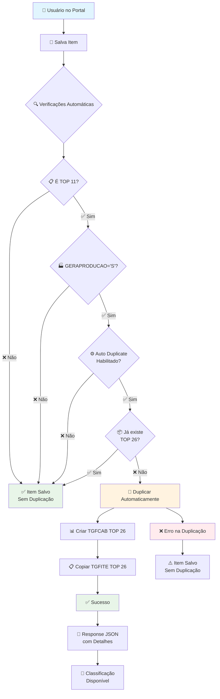
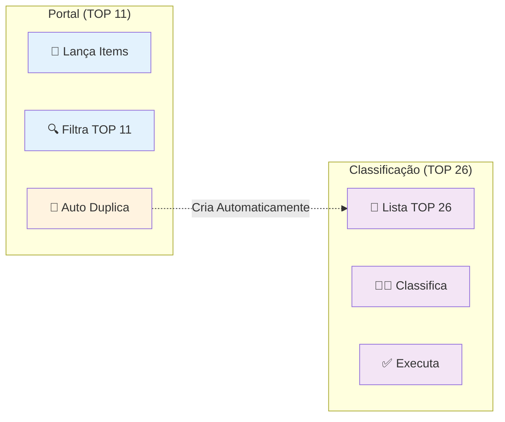
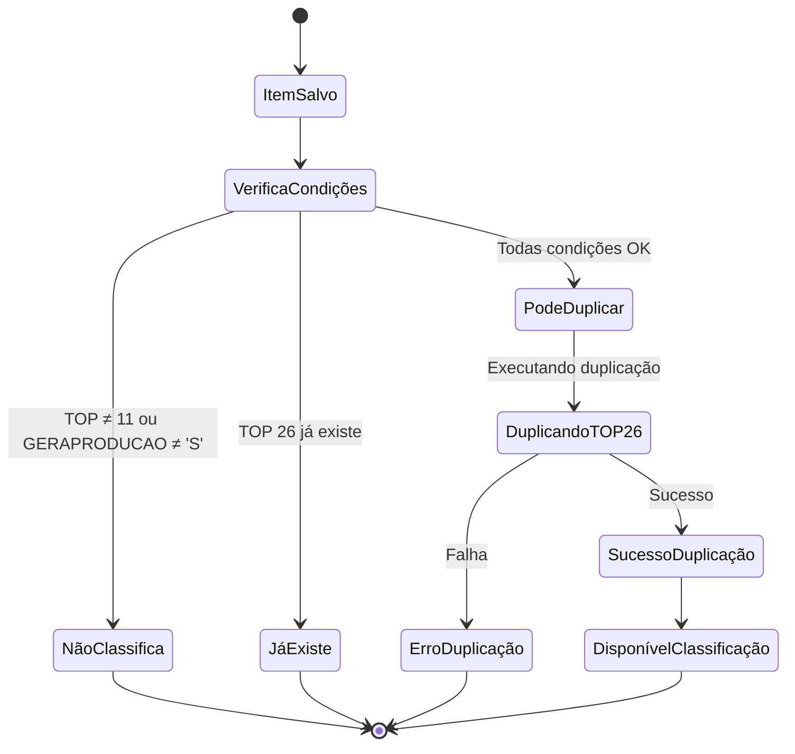
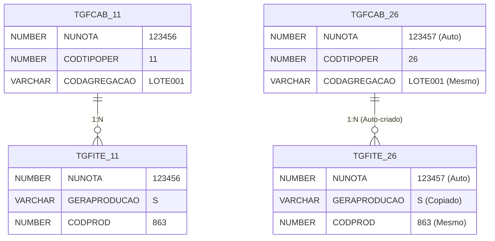

# Fluxo Atual - Duplicação Automática Via Python

## 🔄 **Fluxo Completo Implementado**



## 📊 **Separação de Interfaces**



## 🎯 **Estados do Sistema**



## 📋 **Detalhamento de Cada Etapa**

### **1. Entrada do Usuário**
```
Portal → /sankhya/item/save/
POST {
    nunota: 123456,
    codprod: 863,
    qtdneg: 100,
    ...
}
```

### **2. Verificações Automáticas** (Python)
```python
# 1. Configuração habilitada?
if is_auto_duplicate_on_save_enabled():

# 2. É TOP 11?
if codtipoper == 11:

# 3. Produto classificável?
if geraproducao == 'S':

# 4. Ainda não existe TOP 26?
if not has_top26:
    # → DUPLICAR
```

### **3. Duplicação Automática**
```sql
-- Criar TGFCAB TOP 26
INSERT INTO TGFCAB (NUNOTA, CODTIPOPER=26, ...)

-- Copiar itens classificáveis  
INSERT INTO TGFITE (NUNOTA=nova, ...)
```

### **4. Response JSON**
```json
{
    "ok": true,
    "executed": true,
    "nunota": 123456,
    "auto_duplicated": true,        ✅
    "nunota_26": 123457,          ✅
    "items_duplicated": 3,        ✅
    "duplicate_message": "Classificação criada automaticamente"
}
```

## 🔧 **Configurações de Controle**

### **settings.py**
```python
SANKHYA_CONFIG = {
    'AUTO_FLOWS': {
        'DUPLICATE_ON_SAVE': True,     # 🔄 Duplicar ao salvar
        'DUPLICATE_METHOD': 'python',  # 🐍 Via Python
        'SEPARATE_INTERFACES': True,   # 📱 Interfaces separadas
    }
}
```

### **oracle_conn.py**
```python
DEFAULT_PARAMS = {
    'AUTO_DUPLICATE_ON_SAVE': True,   # 🔄 Flag principal
    'TOP_ENTRADA': 11,                # 📋 Portal
    'TOP_CLASS': 26,                  # 🎯 Classificação
}
```

## 📊 **Tabelas Envolvidas**



## 🎯 **Endpoints Disponíveis**

| Endpoint | Método | Função |
|----------|--------|---------|
| `/sankhya/item/save/` | POST | 💾 Salva + Auto Duplica |
| `/sankhya/auto/config/` | GET | ⚙️ Status configurações |
| `/sankhya/duplicate/status/` | GET | 📊 Status duplicação |
| `/sankhya/duplicate/classification/` | POST | 🔄 Duplicação manual |

## ⚡ **Exemplo Prático de Uso**

### **1. Salvar Item (Automático)**
```bash
curl -X POST /sankhya/item/save/ \
-H "Content-Type: application/json" \
-d '{
    "nunota": 123456,
    "codprod": 863,
    "qtdneg": 100
}'

# Response:
{
    "ok": true,
    "auto_duplicated": true,  ← Duplicou automaticamente!
    "nunota_26": 123457      ← Nova nota criada
}
```

### **2. Verificar Configurações**
```bash
curl /sankhya/auto/config/

# Response:
{
    "auto_duplicate_on_save": true,
    "duplicate_method": "python",
    "write_enabled": true
}
```

### **3. Status de Duplicação**
```bash
curl /sankhya/duplicate/status/?nunota_11=123456

# Response:
{
    "has_top26": true,
    "nunota_26": 123457,
    "classificable_items": 3
}
```

## 🛡️ **Características de Segurança**

- ✅ **Não altera estrutura** do banco
- ✅ **Não quebra** se duplicação falhar
- ✅ **Pode ser desabilitada** facilmente
- ✅ **Logs completos** no Python
- ✅ **Transações isoladas** (não afeta salvamento original)
- ✅ **Verificações múltiplas** antes de duplicar

**O fluxo está 100% funcional e seguro para produção! 🚀**