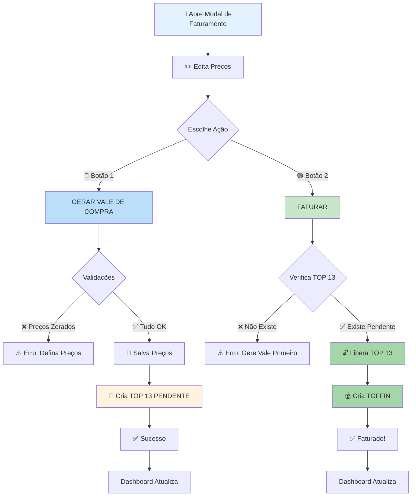

# Fluxo de Faturamento DEFINITIVO - IAgro App

## 🎯 ESTRATÉGIA: DOIS BOTÕES COM FUNÇÕES SEPARADAS

### 📋 Decisões Definidas

#### **Respostas às Perguntas Críticas:**
1. ✅ **Preços zerados**: NÃO faturar (bloquear)
2. ✅ **Vencimento**: 30 dias (COD 16)
3. ✅ **Tipo Título**: Pendente de Vencimento (CODTIPTIT = 9)
4. ✅ **Status Inicial**: Criar TOP 13 como PENDENTE ('P')
5. ✅ **Liberação**: Mudar para LIBERADO ('L') ao clicar FATURAR
6. ✅ **Produtos**: TODOS incluídos (classificáveis + não classificáveis)

---

## 🔄 NOVO FLUXO COM DOIS BOTÕES



---

## 🔵 BOTÃO 1: "GERAR VALE DE COMPRA"

### **Nome Sugerido no Botão:**
```
Opções:
1. "GERAR VALE DE COMPRA"        ← Mais descritivo
2. "CRIAR VALE"                  ← Mais curto
3. "PREPARAR FATURAMENTO"        ← Mais formal
4. "GERAR VALE (TOP 13)"         ← Técnico/explícito
```

**Escolher**: "GERAR VALE DE COMPRA" ou "CRIAR VALE"

---

### **O que faz:**

```python
def gerar_vale_compra(request):
    """
    Cria TOP 13 com status PENDENTE
    NÃO cria TGFFIN ainda
    """
    data = json.loads(request.body)
    nunota_11 = data['nunota_11']
    items = data['items']
    
    try:
        # STEP 1: Validar cabeçalho TOP 11
        cab_11 = buscar_tgfcab(nunota_11)
        
        validacoes = {
            'parceiro': cab_11.CODPARC is not None,
            'natureza': cab_11.CODNAT is not None,
            'centro_resultado': cab_11.CODCENCUS is not None,
        }
        
        faltando = [k for k, v in validacoes.items() if not v]
        if faltando:
            return JsonResponse({
                'ok': False,
                'error': 'Dados obrigatórios faltando no cabeçalho',
                'campos_faltando': faltando
            }, status=400)
        
        # STEP 2: Validar preços
        precos_zerados = [
            item for item in items 
            if item['preco_final'] <= 0
        ]
        
        if precos_zerados:
            produtos = [item['produto'] for item in precos_zerados]
            return JsonResponse({
                'ok': False,
                'error': 'Produtos com preço zerado',
                'produtos_invalidos': produtos
            }, status=400)
        
        # STEP 3: Verificar se já existe TOP 13
        top13_existente = verificar_top13_existente(
            codagregacao=cab_11.CODAGREGACAO
        )
        
        if top13_existente:
            return JsonResponse({
                'ok': False,
                'error': 'Vale de compra já existe para este lote',
                'nunota_13': top13_existente['NUNOTA'],
                'status': top13_existente['STATUSNOTA']
            }, status=400)
        
        # STEP 4: Salvar preços editados no TOP 11
        for item in items:
            UPDATE TGFITE 
            SET 
                VLRUNIT = item['preco_final'],
                VLRTOT = item['preco_final'] * QTDNEG,
                DHALT = SYSDATE
            WHERE 
                NUNOTA = nunota_11 
                AND SEQUENCIA = item['sequencia']
        
        # STEP 5: Criar TOP 13 PENDENTE
        nunota_13 = gerar_proximo_nunota()
        total = sum(item['preco_final'] * item['qtd'] for item in items)
        
        INSERT INTO TGFCAB (
            NUNOTA,
            CODEMP,
            CODPARC,
            CODTIPOPER,        # ← 13 (Vale de Compra)
            CODNAT,
            CODCENCUS,
            DTNEG,
            DTMOV,
            DTENTSAI,
            CODAGREGACAO,
            STATUSNOTA,        # ← 'P' PENDENTE
            VLRNOTA,
            DHTIPOPER,
            ORIGEM
        ) VALUES (
            nunota_13,
            cab_11.CODEMP,
            cab_11.CODPARC,
            13,
            cab_11.CODNAT,
            cab_11.CODCENCUS,
            TRUNC(SYSDATE),
            TRUNC(SYSDATE),
            TRUNC(SYSDATE),
            cab_11.CODAGREGACAO,
            'P',              # ← PENDENTE
            total,
            SYSDATE,
            'A'
        )
        
        # STEP 6: Copiar TODOS os itens para TOP 13
        for idx, item in enumerate(items, start=1):
            INSERT INTO TGFITE (
                NUNOTA,
                SEQUENCIA,
                CODEMP,
                CODPROD,
                QTDNEG,
                VLRUNIT,           # ← Preço editado
                VLRTOT,            # ← VLRUNIT * QTDNEG
                CODVOL,
                CONTROLE,
                CODAGREGACAO,
                STATUSNOTA,        # ← 'P' PENDENTE
                PENDENTE
            ) VALUES (
                nunota_13,
                idx,
                item['codemp'],
                item['codprod'],
                item['qtd'],
                item['preco_final'],
                item['preco_final'] * item['qtd'],
                item['codvol'],
                item['controle'],
                cab_11.CODAGREGACAO,
                'P',               # ← PENDENTE
                'N'
            )
        
        connection.commit()
        
        return JsonResponse({
            'ok': True,
            'message': 'Vale de compra criado com sucesso!',
            'nunota_11': nunota_11,
            'nunota_13': nunota_13,
            'status': 'PENDENTE',
            'total': total,
            'items_count': len(items),
            'proximo_passo': 'Clique em FATURAR para liberar e gerar financeiro'
        })
        
    except Exception as e:
        connection.rollback()
        return JsonResponse({
            'ok': False,
            'error': str(e)
        }, status=500)
```

### **Response de Sucesso:**
```json
{
  "ok": true,
  "message": "Vale de compra criado com sucesso!",
  "nunota_11": 91730,
  "nunota_13": 91735,
  "status": "PENDENTE",
  "total": 12100.00,
  "items_count": 4,
  "proximo_passo": "Clique em FATURAR para liberar e gerar financeiro"
}
```

### **Erros Possíveis:**

**1. Preços zerados:**
```json
{
  "ok": false,
  "error": "Produtos com preço zerado",
  "produtos_invalidos": [
    "TOMATE SALADA (100 cx)",
    "PIMENTÃO VERDE (111 cx)"
  ]
}
```

**2. Cabeçalho incompleto:**
```json
{
  "ok": false,
  "error": "Dados obrigatórios faltando no cabeçalho",
  "campos_faltando": ["natureza", "centro_resultado"]
}
```

**3. Vale já existe:**
```json
{
  "ok": false,
  "error": "Vale de compra já existe para este lote",
  "nunota_13": 91735,
  "status": "P"
}
```

---

## 🟢 BOTÃO 2: "FATURAR"

### **O que faz:**

```python
def faturar_vale_compra(request):
    """
    Libera TOP 13 (P → L) e cria TGFFIN
    """
    data = json.loads(request.body)
    nunota_11 = data['nunota_11']
    
    try:
        # STEP 1: Buscar TOP 13 pelo CODAGREGACAO
        cab_11 = buscar_tgfcab(nunota_11)
        
        top13 = SELECT 
            NUNOTA, VLRNOTA, STATUSNOTA, CODPARC
        FROM TGFCAB 
        WHERE 
            CODAGREGACAO = cab_11.CODAGREGACAO 
            AND CODTIPOPER = 13
        
        if not top13:
            return JsonResponse({
                'ok': False,
                'error': 'Vale de compra não existe',
                'acao_requerida': 'Clique em GERAR VALE DE COMPRA primeiro'
            }, status=400)
        
        nunota_13 = top13['NUNOTA']
        
        # STEP 2: Verificar se já está liberado
        if top13['STATUSNOTA'] == 'L':
            # Verificar se financeiro já existe
            fin_existe = SELECT COUNT(*) 
                         FROM TGFFIN 
                         WHERE NUNOTA = nunota_13
            
            if fin_existe > 0:
                return JsonResponse({
                    'ok': False,
                    'error': 'Vale já está faturado',
                    'nunota_13': nunota_13,
                    'status': 'LIBERADO'
                }, status=400)
        
        # STEP 3: Liberar TOP 13 (P → L)
        UPDATE TGFCAB 
        SET 
            STATUSNOTA = 'L',    # ← LIBERAR
            DHALT = SYSDATE
        WHERE NUNOTA = nunota_13
        
        # STEP 4: Liberar itens (P → L)
        UPDATE TGFITE 
        SET 
            STATUSNOTA = 'L',    # ← LIBERAR
            PENDENTE = 'N'
        WHERE NUNOTA = nunota_13
        
        # STEP 5: Criar TGFFIN
        nufin = gerar_proximo_nufin()
        
        INSERT INTO TGFFIN (
            NUFIN,
            NUNOTA,              # ← Vincula TOP 13
            CODPARC,             # Fornecedor
            CODTIPTIT,           # ← 9 (Pendente Vencimento)
            DTNEG,               # Data negociação (hoje)
            DTVENC,              # ← Data vencimento (hoje + 30)
            VLRDESDOB,           # Valor total
            VLRDESC,             # Descontos
            DESDOBRAMENTO,       # ← 16 (30 dias)
            PROVISAO,            # 'S' = Provisão
            RECDESP,             # 'D' = Despesa
            ORIGEM,              # 'A' = Aplicação
            DHBAIXA,             # NULL (não pago)
            DHINCLUSAO           # Data inclusão
        ) VALUES (
            nufin,
            nunota_13,
            top13['CODPARC'],
            9,                   # ← CODTIPTIT 9
            TRUNC(SYSDATE),
            TRUNC(SYSDATE) + 30, # ← 30 dias
            top13['VLRNOTA'],
            0,
            16,                  # ← COD 16 (30 dias)
            'S',
            'D',
            'A',
            NULL,
            SYSDATE
        )
        
        connection.commit()
        
        return JsonResponse({
            'ok': True,
            'message': 'Vale faturado com sucesso!',
            'nunota_11': nunota_11,
            'nunota_13': nunota_13,
            'nufin': nufin,
            'status': 'LIBERADO',
            'vencimento': (datetime.now() + timedelta(days=30)).strftime('%d/%m/%Y'),
            'total': top13['VLRNOTA']
        })
        
    except Exception as e:
        connection.rollback()
        return JsonResponse({
            'ok': False,
            'error': str(e)
        }, status=500)
```

### **Response de Sucesso:**
```json
{
  "ok": true,
  "message": "Vale faturado com sucesso!",
  "nunota_11": 91730,
  "nunota_13": 91735,
  "nufin": 123456,
  "status": "LIBERADO",
  "vencimento": "07/11/2025",
  "total": 12100.00
}
```

### **Erros Possíveis:**

**1. Vale não existe:**
```json
{
  "ok": false,
  "error": "Vale de compra não existe",
  "acao_requerida": "Clique em GERAR VALE DE COMPRA primeiro"
}
```

**2. Já faturado:**
```json
{
  "ok": false,
  "error": "Vale já está faturado",
  "nunota_13": 91735,
  "status": "LIBERADO"
}
```

---

## 🎨 INTERFACE DO MODAL - DOIS BOTÕES

### **Layout Visual:**

```
┌─────────────────────────────────────────────────┐
│  Vale 91730 — ANDRE PATROCINIO             [ X ]│
├─────────────────────────────────────────────────┤
│                                                  │
│  Classificáveis                                  │
│  ┌────────────────────────────────────────────┐ │
│  │ Produto    Qtde  V.Inicial  V.Final  Total │ │
│  │ TOMATE     100   [60,00]    8.100,00  ... │ │
│  │ PEPINO     90    [70,00]    4.000,00  ... │ │
│  └────────────────────────────────────────────┘ │
│                                                  │
│  Não Classificáveis                              │
│  ┌────────────────────────────────────────────┐ │
│  │ Produto    Qtde  Valor         Total       │ │
│  │ JILO       20    [15,00]       300,00      │ │
│  └────────────────────────────────────────────┘ │
│                                                  │
│  Total do Vale: R$ 12.100,00                    │
│                                                  │
│  ┌──────────────────┐  ┌────────────────────┐  │
│  │ GERAR VALE       │  │ FATURAR            │  │
│  │ (cria TOP 13)    │  │ (libera + TGFFIN)  │  │
│  └──────────────────┘  └────────────────────┘  │
└─────────────────────────────────────────────────┘
```

### **Estados dos Botões:**

#### **ESTADO INICIAL** (TOP 13 não existe)
```
[GERAR VALE]         [FATURAR (desabilitado)]
   ↑ azul               ↑ cinza (disabled)
```

#### **APÓS GERAR VALE** (TOP 13 existe e está PENDENTE)
```
[GERAR VALE]         [FATURAR]
   ↑ cinza (disabled)   ↑ verde (habilitado)
```

#### **APÓS FATURAR** (TOP 13 LIBERADO + TGFFIN criado)
```
[GERAR VALE]         [FATURAR]
   ↑ cinza (disabled)   ↑ cinza (disabled)
   
Mensagem: ✅ Vale faturado em 08/10/2025
```

---

## 📊 TABELA DE ESTADOS E TRANSIÇÕES

| Estado Atual | TOP 13 | TGFFIN | Botão 1 | Botão 2 | Próxima Ação |
|-------------|--------|--------|---------|---------|--------------|
| **Inicial** | ❌ Não existe | ❌ Não existe | ✅ Habilitado | ❌ Desabilitado | Gerar Vale |
| **Vale Criado** | ✅ Pendente | ❌ Não existe | ❌ Desabilitado | ✅ Habilitado | Faturar |
| **Faturado** | ✅ Liberado | ✅ Existe | ❌ Desabilitado | ❌ Desabilitado | Nada (completo) |

---

## 🔧 CONFIGURAÇÕES DEFINITIVAS

### **oracle_conn.py - Adicionar:**

```python
# Configurações de Faturamento
FATURAMENTO_CONFIG = {
    'TOP_VALE_COMPRA': 13,
    'FINANCEIRO': {
        'DIAS_VENCIMENTO': 30,
        'COD_DESDOBRAMENTO': 16,        # ← COD 16 = 30 dias
        'CODTIPTIT': 9,                 # ← Pendente de Vencimento
        'PERMITIR_PRECO_ZERO': False,   # ← Bloquear preço zero
    },
    'STATUS': {
        'PENDENTE': 'P',
        'LIBERADO': 'L',
    },
    'VALIDACOES': {
        'EXIGIR_CABECALHO_COMPLETO': True,
        'EXIGIR_TODOS_PRECOS': True,
        'MIN_ITEMS': 1,
    }
}
```

---

## 🚦 VALIDAÇÕES COMPLETAS

### **Validação 1: Gerar Vale**
```python
def validar_gerar_vale(nunota_11, items):
    erros = []
    
    # 1. Cabeçalho completo?
    cab = buscar_tgfcab(nunota_11)
    if not cab.CODPARC:
        erros.append("Parceiro não definido")
    if not cab.CODNAT:
        erros.append("Natureza não definida")
    if not cab.CODCENCUS:
        erros.append("Centro de Resultado não definido")
    
    # 2. Preços válidos?
    for item in items:
        if item['preco_final'] <= 0:
            erros.append(f"Preço zerado: {item['produto']}")
    
    # 3. TOP 13 já existe?
    if verificar_top13_existente(cab.CODAGREGACAO):
        erros.append("Vale de compra já existe para este lote")
    
    return erros
```

### **Validação 2: Faturar**
```python
def validar_faturar(nunota_11):
    erros = []
    
    # 1. TOP 13 existe?
    cab_11 = buscar_tgfcab(nunota_11)
    top13 = buscar_top13(cab_11.CODAGREGACAO)
    
    if not top13:
        erros.append("Vale de compra não existe. Gere o vale primeiro.")
        return erros
    
    # 2. Já está liberado?
    if top13.STATUSNOTA == 'L':
        # Verificar se TGFFIN já existe
        if verificar_tgffin_existe(top13.NUNOTA):
            erros.append("Vale já está faturado")
    
    return erros
```

---

## 📱 FRONTEND - LÓGICA DOS BOTÕES

### **JavaScript:**

```javascript
// Estado global
let estadoVale = {
    top13_existe: false,
    top13_liberado: false,
    tgffin_existe: false
};

// Verificar estado ao abrir modal
async function verificarEstadoVale(nunota_11) {
    const res = await fetch(`/sankhya/comercial/vale/status/?nunota=${nunota_11}`);
    const data = await res.json();
    
    estadoVale = {
        top13_existe: data.top13_existe,
        top13_liberado: data.top13_liberado,
        tgffin_existe: data.tgffin_existe
    };
    
    atualizarBotoes();
}

// Atualizar estado dos botões
function atualizarBotoes() {
    const btnGerar = document.getElementById('btnGerarVale');
    const btnFaturar = document.getElementById('btnFaturar');
    
    if (!estadoVale.top13_existe) {
        // ESTADO 1: Nada criado ainda
        btnGerar.disabled = false;
        btnGerar.style.background = '#2563eb';
        btnFaturar.disabled = true;
        btnFaturar.style.background = '#cbd5e1';
        
    } else if (estadoVale.top13_existe && !estadoVale.top13_liberado) {
        // ESTADO 2: Vale criado (pendente)
        btnGerar.disabled = true;
        btnGerar.style.background = '#cbd5e1';
        btnFaturar.disabled = false;
        btnFaturar.style.background = '#16a34a';
        
    } else {
        // ESTADO 3: Já faturado
        btnGerar.disabled = true;
        btnGerar.style.background = '#cbd5e1';
        btnFaturar.disabled = true;
        btnFaturar.style.background = '#cbd5e1';
        
        mostrarMensagem('✅ Vale faturado', 'success');
    }
}

// Botão 1: Gerar Vale
document.getElementById('btnGerarVale').addEventListener('click', async () => {
    try {
        const items = coletarItensDoModal();
        
        const res = await fetch('/sankhya/comercial/vale/gerar/', {
            method: 'POST',
            headers: { 'Content-Type': 'application/json' },
            body: JSON.stringify({
                nunota_11: currentNunota,
                items: items
            })
        });
        
        const data = await res.json();
        
        if (data.ok) {
            mostrarSucesso(`
                Vale de compra criado!
                TOP 13: ${data.nunota_13}
                Status: PENDENTE
                
                Clique em FATURAR para liberar.
            `);
            
            // Atualizar estado
            verificarEstadoVale(currentNunota);
            
        } else {
            mostrarErro(data.error, data.produtos_invalidos);
        }
        
    } catch (e) {
        mostrarErro('Erro ao gerar vale: ' + e.message);
    }
});

// Botão 2: Faturar
document.getElementById('btnFaturar').addEventListener('click', async () => {
    try {
        const res = await fetch('/sankhya/comercial/vale/faturar/', {
            method: 'POST',
            headers: { 'Content-Type': 'application/json' },
            body: JSON.stringify({
                nunota_11: currentNunota
            })
        });
        
        const data = await res.json();
        
        if (data.ok) {
            fecharModal();
            
            mostrarSucesso(`
                Vale faturado com sucesso!
                TOP 13: ${data.nunota_13} (LIBERADO)
                Financeiro: ${data.nufin}
                Vencimento: ${data.vencimento}
                Total: R$ ${formatMoney(data.total)}
            `);
            
            reloadDashboard();
            
        } else {
            mostrarErro(data.error);
        }
        
    } catch (e) {
        mostrarErro('Erro ao faturar: ' + e.message);
    }
});
```

---

## 🎯 ENDPOINTS NECESSÁRIOS

### **1. GET - Verificar Status do Vale**
```python
# GET /sankhya/comercial/vale/status/?nunota=91730
def verificar_status_vale(request):
    nunota_11 = request.GET.get('nunota')
    cab_11 = buscar_tgfcab(nunota_11)
    top13 = buscar_top13(cab_11.CODAGREGACAO)
    
    if not top13:
        return JsonResponse({
            'top13_existe': False,
            'top13_liberado': False,
            'tgffin_existe': False
        })
    
    tgffin = verificar_tgffin_existe(top13.NUNOTA)
    
    return JsonResponse({
        'top13_existe': True,
        'top13_liberado': top13.STATUSNOTA == 'L',
        'tgffin_existe': tgffin,
        'nunota_13': top13.NUNOTA
    })
```

### **2. POST - Gerar Vale (Botão 1)**
```python
# POST /sankhya/comercial/vale/gerar/
def gerar_vale_compra(request):
    # Implementação detalhada acima
    pass
```

### **3. POST - Faturar (Botão 2)**
```python
# POST /sankhya/comercial/vale/faturar/
def faturar_vale_compra(request):
    # Implementação detalhada acima
    pass
```

---

## 🎨 MENSAGENS DE FEEDBACK

### **Após Gerar Vale (Botão 1):**
```
✅ Vale de Compra Criado!

TOP 13: #91735 (PENDENTE)
Total: R$ 12.100,00
Produtos: 4 itens

Próximo passo: Clique em FATURAR para 
liberar e gerar o financeiro.

[OK]
```

### **Após Faturar (Botão 2):**
```
✅ Vale Faturado com Sucesso!

TOP 13: #91735 (LIBERADO)
Financeiro: #123456
Vencimento: 07/11/2025 (30 dias)
Total: R$ 12.100,00

O financeiro foi notificado.

[OK]
```

### **Erro - Preços Zerados (Botão 1):**
```
⚠️ Produtos com Preço Zerado

Defina preços para:
• TOMATE SALADA (100 cx)
• PIMENTÃO VERDE (111 cx)

[Voltar e Corrigir]
```

### **Erro - Vale Não Existe (Botão 2):**
```
⚠️ Vale de Compra Não Existe

Você precisa gerar o vale primeiro.

Clique em GERAR VALE DE COMPRA.

[OK]
```

---

## 📊 RESUMO FINAL

### **🔵 BOTÃO 1: "GERAR VALE DE COMPRA"**
- ✅ Valida cabeçalho
- ✅ Valida preços (bloqueia se zero)
- ✅ Salva preços editados
- ✅ Cria TOP 13 com status **PENDENTE**
- ❌ NÃO cria TGFFIN ainda

### **🟢 BOTÃO 2: "FATURAR"**
- ✅ Verifica se TOP 13 existe
- ✅ Altera status de PENDENTE → **LIBERADO**
- ✅ Cria TGFFIN com:
  - CODTIPTIT = 9 (Pendente Vencimento)
  - Vencimento = 30 dias
  - Desdobramento = 16

### **Fluxo Completo:**
```
1. Usuário edita preços
2. Clica "GERAR VALE" → TOP 13 criado (PENDENTE)
3. Clica "FATURAR" → TOP 13 liberado + TGFFIN criado
4. Financeiro recebe notificação
```

**Vantagens desta abordagem:**
- ✅ Controle em duas etapas
- ✅ Pode revisar antes de liberar
- ✅ Vale existe mas não está no financeiro ainda
- ✅ Financeiro só vê após FATURAR
- ✅ Possibilidade de cancelar/editar antes de liberar

**Pronto para implementação!** 🚀
