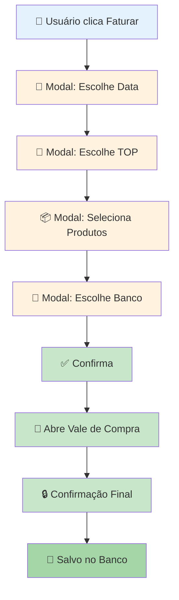
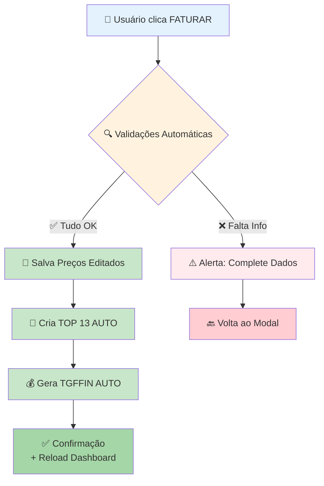

# Fluxo de Faturamento Simplificado - Packing House App

## 📊 Comparação: Sankhya vs Nossa Aplicação

### 🏢 PROCESSO SANKHYA (Manual e Complexo)



**Validações Obrigatórias no Cabeçalho:**
- ✅ Tipo Negociação
- ✅ Parceiro
- ✅ Tipo Operação
- ✅ Natureza
- ✅ Centro Resultado

**Resultado:**
- 1 linha em `TGFCAB` (TOP 13)
- N linhas em `TGFITE` (produtos)
- 1 linha em `TGFFIN` (financeiro)

---

### 🚀 PROCESSO NOSSA APLICAÇÃO (Automático e Simplificado)



---

## 🎯 FLUXO DETALHADO DA NOSSA APLICAÇÃO

### **FASE 1: PRÉ-FATURAMENTO** (Já no Modal)

```
Modal de Faturamento está ABERTO
├─ Classificáveis
│  ├─ Produto 1: R$ 60,00 (editável) ✏️
│  ├─ Produto 2: R$ 70,00 (editável) ✏️
│  └─ Produto 3: R$ 20,00 (editável) ✏️
│
├─ Não Classificáveis  
│  └─ Produto 4: R$ 15,00 (editável) ✏️
│
├─ [Botão: Salvar] → Apenas atualiza TGFITE
└─ [Botão: FATURAR] → Faz tudo!
```

---

### **FASE 2: AO CLICAR EM FATURAR** 

#### **STEP 1: Validações Pré-Execução**

```javascript
// Frontend coleta dados
const payload = {
  nunota_11: 91730,  // Nota TOP 11 original
  items: [
    { nunota: 91730, sequencia: 1, preco_final: 60.00, qtd: 100 },
    { nunota: 91730, sequencia: 2, preco_final: 70.00, qtd: 90 },
    { nunota: 91730, sequencia: 3, preco_final: 20.00, qtd: 111 },
    { nunota: 91730, sequencia: 4, preco_final: 15.00, qtd: 20 },
  ],
  faturar: true  // Flag especial
}

// Envia para backend
POST /sankhya/comercial/vale/faturar/
```

#### **STEP 2: Backend Valida Cabeçalho**

```python
def validar_cabecalho_faturamento(nunota_11):
    """
    Verifica se TOP 11 tem todas informações obrigatórias
    """
    cab = buscar_tgfcab(nunota_11)
    
    validacoes = {
        'tipo_negociacao': cab.CODTIPOPER is not None,  # Deve ser 11
        'parceiro': cab.CODPARC is not None,
        'natureza': cab.CODNAT is not None,
        'centro_resultado': cab.CODCENCUS is not None,
    }
    
    faltando = [k for k, v in validacoes.items() if not v]
    
    if faltando:
        return {
            'ok': False,
            'error': 'Dados obrigatórios faltando',
            'campos_faltando': faltando
        }
    
    return {'ok': True}
```

**Resposta se faltar algo:**
```json
{
  "ok": false,
  "error": "Dados obrigatórios faltando no cabeçalho",
  "campos_faltando": ["centro_resultado", "natureza"]
}
```

---

#### **STEP 3: Salvar Preços Editados (UPDATE)**

```python
def salvar_precos_editados(items):
    """
    Atualiza VLRUNIT e VLRTOT dos itens editados no modal
    """
    for item in items:
        UPDATE TGFITE 
        SET 
            VLRUNIT = item.preco_final,
            VLRTOT = item.preco_final * item.qtd,
            DHALT = SYSDATE
        WHERE 
            NUNOTA = item.nunota 
            AND SEQUENCIA = item.sequencia
```

---

#### **STEP 4: Criar TOP 13 (VALE DE COMPRA)**

```python
def criar_vale_compra(nunota_11, items_com_precos):
    """
    Duplica TOP 11 → TOP 13 com valores finais
    """
    
    # 1. Buscar cabeçalho TOP 11
    cab_11 = buscar_tgfcab(nunota_11)
    
    # 2. Criar TGFCAB TOP 13
    nunota_13 = gerar_proximo_nunota()
    
    INSERT INTO TGFCAB (
        NUNOTA,
        CODEMP,           # Mesmo do TOP 11
        CODPARC,          # Mesmo do TOP 11
        CODTIPOPER,       # 13 (Vale de Compra)
        CODNAT,           # Mesmo do TOP 11
        CODCENCUS,        # Mesmo do TOP 11
        DTNEG,            # Data atual (data do faturamento)
        DTMOV,            # Data atual
        DTENTSAI,         # Data atual
        CODAGREGACAO,     # Mesmo LOTE do TOP 11
        STATUSNOTA,       # 'P' (Pendente) ou 'L' (Liberado)?
        DHTIPOPER,        # SYSDATE
        VLRNOTA,          # Soma total dos itens
        ORIGEM            # 'A' (Aplicação)
    ) VALUES (
        nunota_13,
        cab_11.CODEMP,
        cab_11.CODPARC,
        13,                      # ← TIPO OPERAÇÃO 13
        cab_11.CODNAT,
        cab_11.CODCENCUS,
        TRUNC(SYSDATE),
        TRUNC(SYSDATE),
        TRUNC(SYSDATE),
        cab_11.CODAGREGACAO,
        'P',                     # ← Pendente (aguarda confirmação?)
        SYSDATE,
        :soma_total_items,
        'A'
    )
    
    # 3. Criar TGFITE TOP 13 (copiar todos os itens com preços finais)
    for idx, item in enumerate(items_com_precos, start=1):
        INSERT INTO TGFITE (
            NUNOTA,
            SEQUENCIA,
            CODEMP,
            CODPROD,
            QTDNEG,
            VLRUNIT,           # ← Preço editado/final
            VLRTOT,            # ← VLRUNIT * QTDNEG
            CODVOL,
            CONTROLE,
            CODAGREGACAO,      # Mesmo LOTE
            STATUSNOTA,
            PENDENTE
        ) VALUES (
            nunota_13,
            idx,                           # Nova sequência
            item.codemp,
            item.codprod,
            item.qtdneg,
            item.preco_final,             # ← Preço do modal
            item.preco_final * item.qtdneg,
            item.codvol,
            item.controle,
            cab_11.CODAGREGACAO,
            'P',
            'N'
        )
    
    return nunota_13
```

---

#### **STEP 5: Gerar TGFFIN (FINANCEIRO)**

```python
def gerar_financeiro(nunota_13, cab_11, total_faturado):
    """
    Cria registro financeiro vinculado ao TOP 13
    """
    
    # Configurações padrão (definir no oracle_conn.py)
    CONFIG_FINANCEIRO = {
        'DIAS_VENCIMENTO': 30,           # Vencimento em 30 dias
        'CODTIPTIT': 1,                  # Tipo título (Fornecedor?)
        'FORMA_PAGAMENTO': 'BOL',        # Boleto? Transferência?
        'BANCO_PADRAO': None,            # Definir banco padrão?
    }
    
    # Gerar NUFIN (ID financeiro)
    nufin = gerar_proximo_nufin()
    
    INSERT INTO TGFFIN (
        NUFIN,
        NUNOTA,              # ← Vincula com TOP 13
        CODPARC,             # Fornecedor (mesmo do cabeçalho)
        CODTIPTIT,           # Tipo título
        DTNEG,               # Data negociação (hoje)
        DTVENC,              # Data vencimento (hoje + 30 dias)
        VLRDESDOB,           # Valor total
        VLRDESC,             # Descontos (0 por padrão)
        PROVISAO,            # 'S' = Provisão
        RECDESP,             # 'D' = Despesa (é pagamento a fornecedor)
        ORIGEM,              # 'A' = Aplicação
        DHBAIXA              # NULL (não foi pago ainda)
    ) VALUES (
        nufin,
        nunota_13,
        cab_11.CODPARC,
        CONFIG_FINANCEIRO['CODTIPTIT'],
        TRUNC(SYSDATE),
        TRUNC(SYSDATE) + CONFIG_FINANCEIRO['DIAS_VENCIMENTO'],
        total_faturado,
        0,                   # Sem desconto
        'S',                 # É provisão
        'D',                 # Despesa
        'A',                 # Aplicação
        NULL                 # Não pago
    )
    
    return nufin
```

---

#### **STEP 6: Response de Sucesso**

```python
def faturar_vale_compra(request):
    """
    Endpoint principal de faturamento
    """
    data = json.loads(request.body)
    nunota_11 = data['nunota_11']
    items = data['items']
    
    try:
        # 1. Validar cabeçalho
        validacao = validar_cabecalho_faturamento(nunota_11)
        if not validacao['ok']:
            return JsonResponse(validacao, status=400)
        
        # 2. Salvar preços editados
        salvar_precos_editados(items)
        
        # 3. Calcular total
        total = sum(item['preco_final'] * item['qtd'] for item in items)
        
        # 4. Criar TOP 13
        nunota_13 = criar_vale_compra(nunota_11, items)
        
        # 5. Gerar TGFFIN
        nufin = gerar_financeiro(nunota_13, nunota_11, total)
        
        # 6. Commit transaction
        connection.commit()
        
        # 7. Retornar sucesso
        return JsonResponse({
            'ok': True,
            'message': 'Vale de compra faturado com sucesso!',
            'nunota_11': nunota_11,
            'nunota_13': nunota_13,
            'nufin': nufin,
            'total_faturado': total,
            'items_faturados': len(items)
        })
        
    except Exception as e:
        connection.rollback()
        return JsonResponse({
            'ok': False,
            'error': str(e)
        }, status=500)
```

**Response de Sucesso:**
```json
{
  "ok": true,
  "message": "Vale de compra faturado com sucesso!",
  "nunota_11": 91730,
  "nunota_13": 91735,        // ← Novo vale criado
  "nufin": 123456,           // ← Registro financeiro
  "total_faturado": 12100.00,
  "items_faturados": 4
}
```

---

### **FASE 3: FRONTEND - APÓS SUCESSO**

```javascript
// Ao clicar FATURAR
document.getElementById('valeResumoFaturar').addEventListener('click', async () => {
    try {
        // 1. Mostrar loading
        showLoading('Faturando vale de compra...');
        
        // 2. Coletar dados do modal
        const items = coletarItensDoModal();
        
        // 3. Enviar para backend
        const res = await fetch('/sankhya/comercial/vale/faturar/', {
            method: 'POST',
            headers: { 'Content-Type': 'application/json' },
            body: JSON.stringify({
                nunota_11: currentNunota,
                items: items,
                faturar: true
            })
        });
        
        const data = await res.json();
        
        if (data.ok) {
            // 4. Fechar modal
            closeModal();
            
            // 5. Mostrar sucesso
            showSuccess(`
                Vale de compra faturado com sucesso!
                TOP 13: ${data.nunota_13}
                Total: R$ ${formatMoney(data.total_faturado)}
            `);
            
            // 6. Recarregar dashboard
            reloadDashboard();
            
        } else {
            // Erro de validação
            showError(data.error, data.campos_faltando);
        }
        
    } catch (e) {
        showError('Erro ao faturar: ' + e.message);
    } finally {
        hideLoading();
    }
});
```

---

## 📋 VALIDAÇÕES E REGRAS DE NEGÓCIO

### **Validações Obrigatórias ANTES de Faturar:**

1. **Cabeçalho TOP 11 completo:**
   - ✅ `CODPARC` (Parceiro)
   - ✅ `CODNAT` (Natureza)
   - ✅ `CODCENCUS` (Centro Resultado)
   - ✅ `CODTIPOPER = 11`

2. **Itens com preços válidos:**
   - ✅ Todos os itens têm `VLRUNIT > 0`?
   - ⚠️ Permitir itens com preço zero? (Decidir regra)

3. **Quantidade de itens:**
   - ✅ Pelo menos 1 item para faturar
   - ✅ Quantidade > 0

### **Regras de Criação do TOP 13:**

1. **Produtos incluídos:**
   - ✅ TODOS os produtos (classificáveis + não classificáveis)
   - ✅ Usar preços editados do modal

2. **Valores:**
   - ✅ `VLRUNIT` = Preço editado no modal
   - ✅ `VLRTOT` = VLRUNIT × QTDNEG
   - ✅ `TGFCAB.VLRNOTA` = Soma de todos VLRTOT

3. **Vinculação:**
   - ✅ Mesmo `CODAGREGACAO` (LOTE)
   - ✅ Mesmo `CODPARC` (Fornecedor)
   - ✅ Mesmo `CODCENCUS` e `CODNAT`

### **Regras do TGFFIN:**

1. **Configuração padrão** (definir em `oracle_conn.py`):
   ```python
   FINANCEIRO_CONFIG = {
       'DIAS_VENCIMENTO': 30,
       'TIPO_TITULO': 1,         # A definir
       'FORMA_PAGAMENTO': 'BOL', # A definir
       'BANCO_PADRAO': None,     # A definir
   }
   ```

2. **Valores:**
   - ✅ `VLRDESDOB` = Total do TOP 13
   - ✅ `DTVENC` = Data atual + 30 dias
   - ✅ `RECDESP` = 'D' (Despesa - pagamento a fornecedor)

3. **Status:**
   - ✅ `PROVISAO` = 'S' (É provisão)
   - ✅ `DHBAIXA` = NULL (Não pago)

---

## 🎨 UX/UI - MENSAGENS AO USUÁRIO

### **Antes de Clicar FATURAR:**
```
Modal Aberto
├─ [Info] 💡 Revise os preços antes de faturar
└─ [Botão] FATURAR (verde, destaque)
```

### **Durante o Processo:**
```
🔄 Loading
├─ "Faturando vale de compra..."
├─ "Criando TOP 13..."
└─ "Gerando registro financeiro..."
```

### **Sucesso:**
```
✅ Vale de Compra Faturado!

TOP 13 criado: #91735
Total faturado: R$ 12.100,00
Itens: 4 produtos

[OK]
```

### **Erro - Dados Faltando:**
```
⚠️ Dados Obrigatórios Faltando

O cabeçalho do vale precisa ter:
× Centro de Resultado
× Natureza

Complete estes dados antes de faturar.

[Voltar ao Vale] [Editar Cabeçalho]
```

### **Erro - Preços Zerados:**
```
⚠️ Preços Inválidos

Os seguintes produtos estão sem preço:
• TOMATE SALADA (100 cx)
• PIMENTÃO VERDE (111 cx)

Defina os preços antes de faturar.

[Voltar]
```

---

## 🔧 CONFIGURAÇÕES NECESSÁRIAS

### **1. oracle_conn.py - Adicionar:**

```python
# Configurações de Faturamento
FATURAMENTO_CONFIG = {
    'TOP_VALE_COMPRA': 13,
    'FINANCEIRO': {
        'DIAS_VENCIMENTO': 30,
        'TIPO_TITULO': 1,           # A definir com cliente
        'FORMA_PAGAMENTO': 'BOL',   # Boleto
        'BANCO_PADRAO': None,       # Definir se necessário
        'PERMITIR_PRECO_ZERO': False,  # Bloquear faturamento com preço 0
    },
    'VALIDACOES': {
        'EXIGIR_CABECALHO_COMPLETO': True,
        'EXIGIR_TODOS_PRECOS': True,
        'MIN_ITEMS': 1,
    }
}
```

### **2. views.py - Novo Endpoint:**

```python
@require_http_methods(["POST"])
def faturar_vale_compra(request):
    """
    Endpoint de faturamento completo
    POST /sankhya/comercial/vale/faturar/
    """
    # Implementação detalhada acima
    pass
```

### **3. urls.py - Nova Rota:**

```python
path('comercial/vale/faturar/', views.faturar_vale_compra, name='faturar_vale'),
```

---

## ❓ PERGUNTAS A DEFINIR COM CLIENTE

### **1. Validações de Preço:**
- ❓ Pode faturar com preços zerados?
- ❓ Tem preço mínimo por produto?
- ❓ Precisa validar margem de lucro?

### **2. Configuração Financeira:**
- ❓ Quantos dias para vencimento? (sugestão: 30)
- ❓ Qual tipo de título usar? (CODTIPTIT)
- ❓ Forma de pagamento padrão? (Boleto, Transferência, etc)
- ❓ Precisa vincular a um banco específico?

### **3. Seleção de Produtos:**
- ✅ Faturar TODOS os produtos sempre?
- ❓ Ou permitir desmarcar alguns?
- ✅ Incluir não classificáveis no TOP 13?

### **4. Status da Nota:**
- ❓ TOP 13 criado como 'P' (Pendente) ou 'L' (Liberado)?
- ❓ Precisa de confirmação adicional?
- ❓ Ou já libera direto para financeiro?

### **5. Campos Obrigatórios:**
- ✅ Centro de Resultado (confirmado)
- ✅ Natureza (confirmado)
- ✅ Parceiro (confirmado)
- ❓ Algum outro campo específico?

---

## 🎯 PRÓXIMOS PASSOS

1. **Definir configurações** (responder perguntas acima)
2. **Criar funções auxiliares** em `oracle_conn.py`
3. **Implementar endpoint** `/faturar/`
4. **Testar em ambiente de desenvolvimento**
5. **Ajustar UX/mensagens**
6. **Deploy em produção**

---

## 🚀 RESUMO FINAL

### **O que o usuário vê:**
```
1. Abre modal → Edita preços
2. Clica FATURAR → Loading
3. Recebe confirmação → Dashboard atualiza
```

### **O que acontece por trás:**
```
1. Valida cabeçalho TOP 11
2. Salva preços editados
3. Cria TOP 13 (TGFCAB + TGFITE)
4. Gera TGFFIN
5. Commit no banco
6. Retorna sucesso
```

### **Simplicidade vs Sankhya:**
- ❌ Sankhya: 4 modais + confirmação manual
- ✅ Nossa app: 1 clique + validações automáticas

**O processo inteiro acontece em UMA única transação, garantindo consistência! 🎯**
