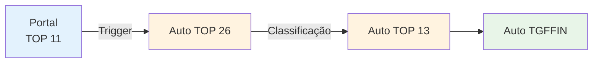
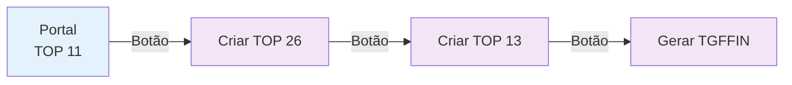
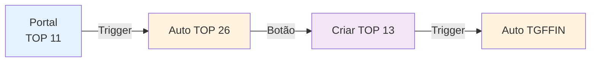
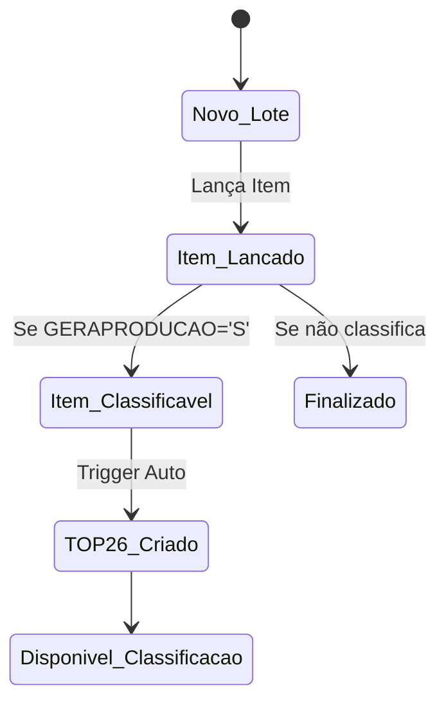
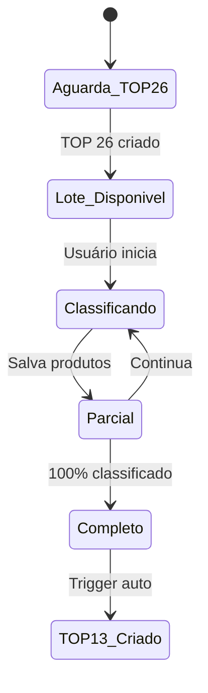
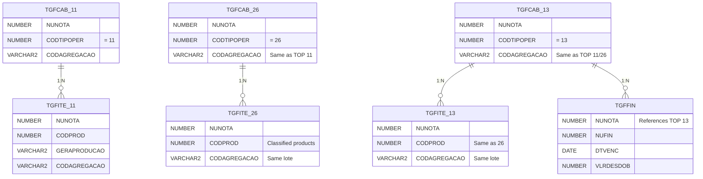

```mermaid
flowchart TD
    A[👤 Usuário no Portal] --> B[📝 Lança Item]
    B --> C{🔍 Produto Classifica?<br/>GERAPRODUCAO='S'}
    
    C -->|❌ Não| D[📋 Apenas TOP 11<br/>Processo Normal]
    C -->|✅ Sim| E[🔄 Trigger Automático]
    
    E --> F[📊 Duplica TGFCAB<br/>TOP 11 → TOP 26]
    F --> G[📦 Duplica TGFITE<br/>Itens Classificáveis]
    
    G --> H[📱 Interface Classificação<br/>Mostra TOP 26]
    H --> I[👨‍🔬 Usuário Classifica<br/>Produtos]
    
    I --> J{📈 Classificação<br/>Completa?}
    J -->|❌ Não| K[⏳ Aguarda Mais<br/>Classificações]
    J -->|✅ Sim| L[🔄 Trigger TOP 13]
    
    K --> I
    
    L --> M[🧾 Cria TGFCAB<br/>TOP 13 - Vale Compra]
    M --> N[📋 Cria TGFITE<br/>TOP 13]
    N --> O[💰 Gera TGFFIN<br/>Financeiro]
    
    O --> P[✅ Processo Completo]
    
    D --> Q[✅ Item TOP 11<br/>Finalizado]
    
    style A fill:#e1f5fe
    style E fill:#fff3e0
    style L fill:#fff3e0
    style P fill:#e8f5e8
    style Q fill:#e8f5e8
    
    classDef userAction fill:#bbdefb,stroke:#1976d2,stroke-width:2px
    classDef systemAction fill:#ffe0b2,stroke:#f57c00,stroke-width:2px
    classDef decision fill:#f3e5f5,stroke:#7b1fa2,stroke-width:2px
    classDef success fill:#c8e6c9,stroke:#388e3c,stroke-width:2px
    
    class A,B,H,I userAction
    class E,F,G,L,M,N,O systemAction  
    class C,J decision
    class P,Q success
```

## Comparação das 3 Opções

### 🏆 Opção A - Triggers Automáticos


**Prós**: Totalmente automático, consistente, rápido
**Contras**: Menos flexível, debugging mais difícil

### 📋 Opção B - Controle por Aplicação


**Prós**: Flexível, fácil debug, controle total
**Contras**: Manual, pode esquecer etapas, inconsistente

### 🔧 Opção C - Híbrida


**Prós**: Balanceada, automação + controle
**Contras**: Complexidade média

## Estados das Interfaces

### Portal (TOP 11)


### Classificação (TOP 26)


## Tabelas Envolvidas

